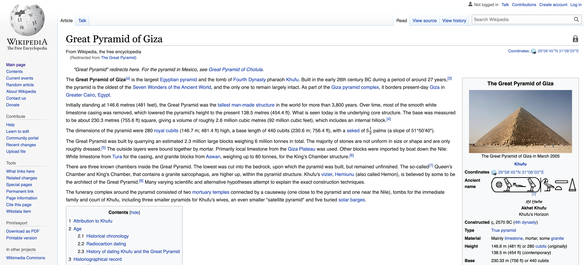

# Lorebook Generator

This repo is designed to help all of us as authors using NovelAI. It pulls from Wikipedia articles to automatically generate lorebooks for real places or years and pretty much anything you could find on Wikipedia using python's wikipedia library.
The repo contains two different versions: a basic one that generates based on a CSV file, 'characters.csv' and a more advanced version that implements multiple keywords for a more tailored search.


## How to use this repository

To use this lorebook generator, follow these steps:

- If you are going to contribute or add things to the repository, fork it before you start.
- To start, you need to clone the repo to your local machine. You can do this by running the following command in your terminal:

Note: you will need to replace the url with your forked repos url. If you are not going to contribute, you can use the original url.

```bash
git clone https://github.com/grahamwaters/lorebook_generator_for_novelai
```

### Mode 1. Basic Mode - Using a CSV file to generate lorebooks
- Once you have it cloned, populate the characters.csv file with your chosen keywords. (You can use the example file as a template.)
- Then run the python script [scripts/03_lorebook_from_wiki_withpulls.py](scripts/03_lorebook_from_wiki_withpulls.py), and it will generate a lorebook for you. This lorebook will be named `lorebook_generated.lorebook` and will be saved in the `supporting_files` folder.

### Mode 2. Subtopics -> to keywords -> to lorebook
If you're feeling adventurous but not super productive you can provide one topic (wikipedia page) to the [mode_2](./scripts/04_get_relevant_subtopics.py) script and it will generate a list of keywords that are relevant to that topic. Then it will generate a lorebook for you based on those keywords. This is a good way to get a quick lorebook for a topic that you don't know much about. It does currently have limitations in that it will provide WAY more information than you may need for a lorebook. So you may need to do some editing to get it to a place where you're happy with it.




As you can see from the screenshot above, the script will look at the wikipedia articles for each character or topic/place in the provided characters csv file. In the case of the pyramid of Giza, it will scan the text of the article for the significant NNS and NNPS (nouns) and then generate a lorebook with the article's text as the meat of the entry, and each of the unique words will be added in as keywords for NovelAI (which will allow the AI to trigger this entry). The script will also generate a list of the nouns it found in the article, which you can use to add to the characters.csv file if you are interested in building out a more robust contextually dense lorebook.

- Once you have a lorebook created, you can upload the lorebook to NovelAI and use it to add background detail to your stories and characters.
# How to Contribute:
We are seeking contributors that are skilled at project organization and formatting. If you are interested in helping out, please contact me on Discord: `@its_graham#7425`
Also, feel free to open issues, pull requests, and make suggestions for this project here on GitHub as well. Working together, we could add some more features to the program, like web scraping historical documents or corpora from Project Gutenberg! That would be really informative.

## Included Files -
- [year_specific_lorebook.py](scripts/01_lorebook_from_year.py)
This script generates a lorebook based on a year. It pulls from Wikipedia articles and generates a lorebook based on the year you input. It also generates a list of characters that are mentioned in the article. This is a good way to get a feel for the program and how it works.

- [Lorebook From Articles](scripts/02_lorebook_from_downloaded_wiki_articles.py)
This script generates a lorebook based on a list of keywords. It pulls from Wikipedia articles and generates a lorebook based on the keywords you input. It also generates a list of characters that are mentioned in the article. This is a good way to get a feel for the program and how it works.

- [characters.csv](characters.csv)

This is a CSV file that contains a list of characters that are mentioned in the lorebook. It is generated by the scripts above and will be originally populated by the author to fit their story.


# Areas Currently in Development
- [ ] Working through the notebooks in `notebooks/` to make sure they are up to date with the scripts in `scripts/` and that they are needed.
- [ ] Improving the quality of the generated lorebooks in the following areas:
  - [ ] Parsed Text Extraction Valence Optimization - Currently the text extraction is not perfect. We need to improve the valence of the text extraction to make sure that the text is relevant to the topic being queried. This is a big one.
  - [ ] Integrating sklearn or potentially other libraries to improve the quality of the generated text. (i.e., PyTorch, TensorFlow, etc.)
  - [ ] Identification of instances in the text where the following pattern exists:
    - [ ] `character one` and `character two` are both mentioned within some distance `d` of each other. This is an interesting method of identifying characters that are related to each other. Proximity could be useful in determining how these topics or characters should be considered.


- The code is currently adding a huge number of keys to the lorebook. This is potentially causing problems on the server side of NovelAI. I will reduce the key count to less than fifty and see if that helps.


## Future Development Goals
- [place_specific_lorebook.py](scripts/02_lorebook_from_place.py) - This script will be used to generate lorebooks from a specific place. We will do this by using the Wikipedia library to search for a place and then using the article text as the lorebook entry.

# Notes on the Git Ignore
Make sure to include the following in your `.gitignore` when you fork this repo:
- /wikipedia_pages
- /master_pages
- .lorebook

This will ensure that your literary work is kept confidential and that it is separated from the code improvements you discover along the way.


## Authors

- [@grahamwaters](https://www.github.com/grahamwaters)


## License

[MIT](https://choosealicense.com/licenses/mit/)
